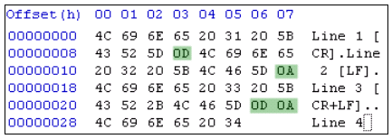

.. meta::
   :description: Files in Python can be opened in either text, binary or the universal newline mode. In this short article we look at the difference between the various modes, with a short code that demonstrates the concept.
   
   :keywords: file mode, binary, text, universal newline
   
.. index:: mode

File modes in Python - Text, Binary and Universal Newline
=========================================================

Files in Python can be opened in either text mode or binary mode. What's the difference? 

The difference lies in how the end-of-line (EOL) is handled. Different operating systems use different characters to mark EOL - ``\n`` in Unix, ``\r`` in Mac versions prior to OS X, ``\r\n`` in Windows. When a file is opened in text mode, when the file is read, Python replaces the OS specific end-of-line character read from the file with just ``\n``. And vice versa, i.e. when you try to write ``\n`` to a file opened in text mode, it is going to write the OS specific EOL character. You can find what your OS default EOL by checking ``os.linesep``. 

When a file is opened in binary mode, no mapping takes place. What you read is what you get. Remember, text mode is the default mode. So if you are handling non-text files (images, video, etc.), make sure you open the file in binary mode, otherwise you'll end up messing up the file by introducing (or removing) some bytes.

Python also has a *universal newline* mode. When a file is opened in this mode, Python maps all of the characters ``\r``, ``\n`` and ``\r\n`` to ``\n``. 

Here is a short example demonstrating various file modes. We will read :download:`this file <./file_modes.txt>` (which contains all the three different EOL types) in Python and examine the contents. ::

Here are the file contents when examined in a Hex Editor, just to show you that it indeed does contain the different EOL characters. 

Here is the code.

.. code-block:: python

    print 'os.linesep: %r' % os.linesep
    for mode in ['r', 'rU', 'rb']:
        with open('file_new_lines.txt', mode) as f:
            print '%02s: %r' %(mode, f.read())
    
And here are the results (on Windows XP).

.. code-block:: python

    os.linesep: '\r\n'
     r: 'Line 1 [CR]\rLine 2 [LF]\nLine 3 [CR+LF]\nLine 4'
    rU: 'Line 1 [CR]\nLine 2 [LF]\nLine 3 [CR+LF]\nLine 4'
    rb: 'Line 1 [CR]\rLine 2 [LF]\nLine 3 [CR+LF]\r\nLine 4'
