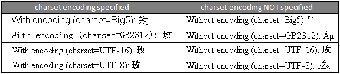

On Why HTML Charset Encodings are Important 
============================================

If you work with HTML/XML files in Python, it helps to understand how HTML encoding works. HTML files, just like any other files, can be saved in many different encodings (but *please* don't use anything other than UTF-8!). For the browser to display them correctly, you need explicitly  `declare the encoding of the document`_. This can be done by specifying the encoding in the `meta charset attribute`_ (for example ``<meta charset="UTF-8">``) in HTML5 or in the `pragma directive`_ (for example ``<meta http-equiv="Content-Type" content="text/html; charset=UTF-8">``) in HTML 4.

A rose in any encoding may not render as sweet
-----------------------------------------------
Let's create and save HTML files in a bunch of different encodings (both with and without the appropriate charset encodings specified) and see how they render in the browser. ::

    def create_html_files(doc, text, charsets, meta_tag=False):
        for cs in charsets:
            fname = ('with_meta_charset_' if meta_tag else 
                     'without_meta_charset_') 
            fname = fname + cs + '.html'
            with open(fname, 'wb') as f:
                f.write(doc.format(cs=cs, text=text).encode(cs))

Okay, first let's create a bunch of files with encoding not specified in the HTML source. You can download the HTML files encoded in various formats :download:`here <./html_encodings.zip>`. ::

    charsets = ['Big5', 'GB2312', 'UTF-16', 'UTF-8']
    rose_uni = u'\u73ab'
    doc_no_cs = \
    u'''<!DOCTYPE HTML PUBLIC "-//W3C//DTD HTML 4.01//EN"
    "http://www.w3.org/TR/html4/strict.dtd">
    <html>
        <head>
            <title>Without encoding. Rose in {cs} 
            </title>
        </head>
        <body>
            
 Without encoding (charset={cs}): {text} 

        </body>
    </html>'''
    
    create_html_files(doc_no_cs, rose_uni, charsets, False)

And more files with encoding specified in HTML source. You can download the HTM files encoded in various formats :download:`here <./html_encodings.zip>`. ::

    doc_with_cs = \
    u'''<!DOCTYPE HTML PUBLIC "-//W3C//DTD HTML 4.01//EN"
    "http://www.w3.org/TR/html4/strict.dtd">
    <html>
        <head>
           <meta http-equiv="Content-Type" content="text/html; charset={cs}">
           <title>With encoding. Rose in {cs}
           </title>
        </head>
        <body>
            
 With encoding (charset={cs}): {text} 

        </body>
    </html>'''
    
    create_html_files(doc_with_cs, rose_uni, charsets, True)

Here is how the files render on my Mozilla FireFox 6.0.2 browser. 

As you can see, if the encoding is not specified correctly, all you end up with is a mishmash of random characters. So encode in UTF-8 whenever possible and specify the charset in your HTML source code and you can be sure that the file will be rendered in the browsers as you intended it to be rendered.

.. _`declare the encoding of the document`: http://www.w3.org/International/questions/qa-html-encoding-declarations#quicklookup

.. _`meta charset attribute`: http://www.w3.org/International/questions/qa-html-encoding-declarations#html5charset

.. _`pragma directive`: http://www.w3.org/International/questions/qa-html-encoding-declarations#metacontenttype
