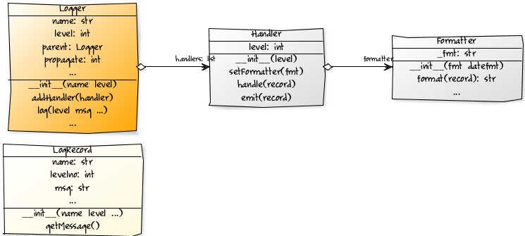
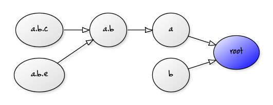
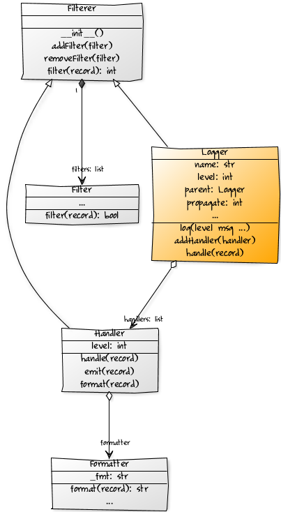

.. meta::
   :description: The logging module in python makes it very easy log the messages from within your code. This article explains the internals of the Python logging module, how the whole process works, and a quick example of how to use the module. 

   :keywords: logging, logger, handler, formatter, logrecord, filterer, python
   
.. index:: logging

How the ``logging`` Module Works
================================

Have you have ever tried debugging your code by adding a bunch of ``print`` statements all over? Did you quickly lose track of what you were trying to find in a sea of messages that were printed out? Did you feel like you needed a better way to log the messages in production mode to go back and debug when there is an error? If yes, you might want to check out the built-in ``logging`` module in Python. It is very flexible and allows you to log to multiple destinations with a lot of options to filter the messages before logging. Here is an overview of how this module works along with a glimpse of its internal architecture.

How the ``logging`` Process Works - The Basics
-----------------------------------------------

First let me introduce the main cast of the ``logging`` module - ``Logger``, ``Handler`` and ``Formatter`` and ``LogRecord``.

   
This is how the logging process works.

- Loggers, Handlers and LogRecords have a severity ``level``. These are the default levels defined in the module - ``CRITICAL = 50``, ``ERROR = 40``, ``WARNING = 30``, ``INFO = 20``, ``DEBUG = 10``, ``NOTSET = 0``. You can create your own or customize them.
- You send messages to be logged to a Logger using the ``log`` method of the Logger. The ``log`` method needs two parameters - a ``msg`` (message) and the *severity* ``level``. 
- Logger also has a few convenience methods defined - ``debug``, ``warning``, ``error``, ``critical`` etc. each of which has a pre-defined severity level. These methods are identical to the ``log`` method (except that you don't have to specify the level, because the level is implicit).
- Logger looks at the message and ignores it if the message level is less severe than its own level. If not, it'll create a LogRecord object from the message string and pass the LogRecord to its Handlers (and also to its parents; more on that in a moment).
- The Handler is responsible for outputting your message - to a file, stream, socket or where ever you want it to go. You can add a Handler to the Logger by using the ``addHandler`` method of the Logger. A Logger can have multiple Handlers attached. There are a lot of custom handlers (like FileHandler, RotatingFileHandler, HTTPHandler, etc.) in the logging module. Use them to make your life easier.
- The Handler also has a level. Once the Handler receives the LogRecord from the Logger, it will ignore any LogRecord that has a severity level that is smaller than its own level. Otherwise it passes the LogRecord to its Formatter.
- Each Handler has one Formatter (which you can customize to your taste). The Formatter formats the LogRecord message to the desired format and sends the formatted text back to the Handler. You can set the Formatter for a Handler with the ``setFormatter`` method.
- Finally the Handler receives the message as formatted text back from the Formatter and emits it to your destination. That's it!

One more thing.

- All loggers are arranged in a hierarchy based on their name. This hierarchy is a dotted namespace hierarchy of logger names. Just a fancy way of saying that Logger named ``'A'`` is a parent of ``'A.B'`` which in turn is a parent of ``'A.B.C'`` and so on.
- The *root logger* is at the top of this hierarchy. The name of the root logger is an empty string: ``''``. In the above case, the parent of ``'A'`` is the ``root``. 
- The hierarchy is created and managed automatically by the logging module. If you create a new logger ``'A.B.E'`` it's parent will automatically be ``'A.B'``, and if you create a new logger ``'B'`` it's parent will be the ``root``.
- Any message sent to a logger is automatically sent to its parent which in turn sends it to its parent and so on. For example message sent to ``'A.B.C'`` is sent to ``'A.B'`` and then to ``'A'`` and so on. You can *turn off* this upward propagation by setting the ``propagate`` attribute of a logger to 0. Once the parent logger receives the message all steps outlined above are restarted.

   
How the ``logging`` Process Works - Advanced
---------------------------------------------

Now that you know the basic plot, let me introduce one more character - the ``Filter``.

- Filter as the name suggests, allows you to filter a message before you log it. Yes, messages are filtered based on the ``level`` setting, but adding a Filter gives you more fine grained control of messages you log.
- Both Loggers and Handlers can have multiple Filters. You can add Filters using ``addFilter`` and ``removeFilter`` methods.
- When a Logger/Handler receives a message, it consults all of its filters. If the ``filter(record)`` method on any of the Filters attached returns ``False`` (or ``0``) the message is dropped. 
- The official documentation, though detailed, is actually pretty confusing about the role of Filters. This is a pity; because Filters can be handy when you want to drop a message based on a regular expression, error code, contextual information and pretty much anything else. The default Filter is pretty much useless (and the docstring is very confusing too). Just inherit from the default filter and override the ``filter`` method according to what you want to filter out. (Be sure to download the source for ``logging`` module and check out the unit tests which have some good examples. See the references at the end of this article.)

How to Use the ``logging`` Module
----------------------------------

Here is a quick demo of how you can use the ``logging`` module. ::

    import logging
    # create logger
    lgr = logging.getLogger('myapp')
    lgr.setLevel(logging.DEBUG)
    # add a file handler
    fh = logging.FileHandler('myapp.log')
    fh.setLevel(logging.WARNING)
    # create a formatter and set the formatter for the handler.
    frmt = logging.Formatter('%(asctime)s - %(name)s - %(levelname)s - %(message)s')
    fh.setFormatter(frmt)
    # add the Handler to the logger
    lgr.addHandler(fh)
    # You can now start issuing logging statements in your code
    lgr.debug('debug message') # This won't print to myapp.log
    lgr.info('info message') # Neither will this.
    lgr.warn('Checkout this warning.') # This will show up in the log file.
    lgr.error('An error goes here.') # and so will this.
    lgr.critical('Something critical happened.') # and this one too.
    
Here is a sample output of the log file ``myapp.log``. ::

    2011-10-24 10:16:34,164 - myapp - WARNING - Checkout this warning.
    2011-10-24 10:16:34,164 - myapp - ERROR - An error goes here.
    2011-10-24 10:16:34,164 - myapp - CRITICAL - Something critical happened.

Note that this is a very simple example. The `official documentation`_ for the ``logging`` module is excellent and has a lot of examples. 

Summary
-------
The logging module makes it very easy to log the messages with varying degrees of severity to various different destinations. Use it instead of relying on ``print`` statements to debug your code. As you code grows in complexity, having the right logs will make debugging much easier.

.. _`official documentation`: http://docs.python.org/library/logging.html

.. seealso::
  
  - `A logging System for Python <http://www.red-dove.com/python_logging.html>`_ by Vinay Sajip (the original author and maintainer of the ``logging`` module). Be sure to download the source code from the site and **check out the unit tests** especially ``log_test18.py``, ``log_test20.py`` and ``log_test21.py`` which have good examples on using Filters.
  - :pep:`282` - A Logging system. 
  - `Python official documentation <http://docs.python.org/library/logging.html>`_ for the ``logging`` Module (of course).
